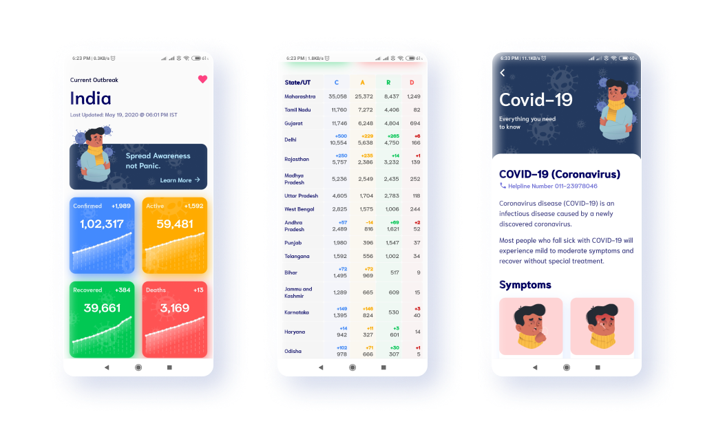
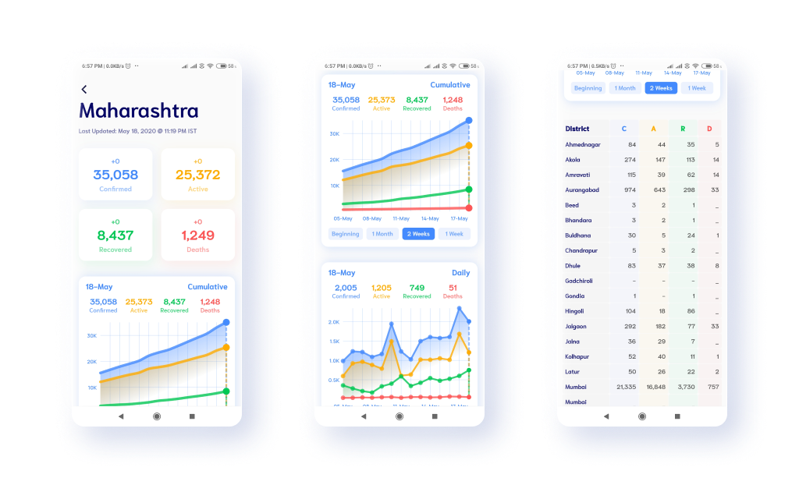

# Covid - 19 India

### [Download Android APK](https://firebasestorage.googleapis.com/v0/b/covid-19-india-flutter.appspot.com/o/apks%2Fcovid19_crazybytes_1_0.apk?alt=media&token=e5a44074-a72d-4f5a-97ec-df49902508fe)

 A flutter app to track Corona Virus outbreak in India. It fetches the data from (Covid19India API)[https://api.covid19india.org/]. The app also helps people to be safe during this unforeseen situation. We are also working to display Global Covid-19 Data in the app. 

 ### Contributions are Welcome
The code of the app is fully open source and you can also contribute to make this app better and more useful. But before contributing, please discuss with me by opening a new issue or through comments on existing issues.

## Screenshots

### HomeScreen

### State Screen

# Download the Covid-19 Android Apk from [here](https://firebasestorage.googleapis.com/v0/b/covid-19-india-flutter.appspot.com/o/apks%2Fcovid19_crazybytes_1_0.apk?alt=media&token=e5a44074-a72d-4f5a-97ec-df49902508fe)

